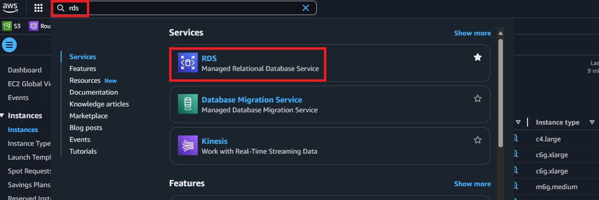
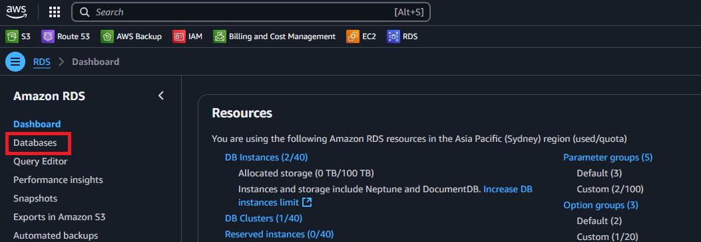
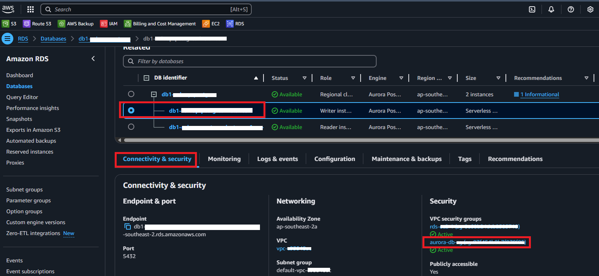
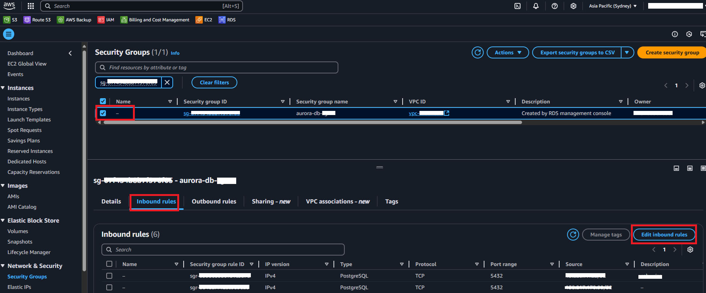
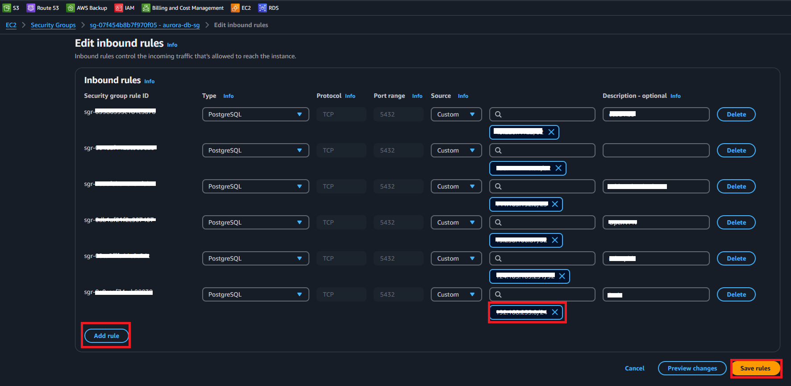

# Updating the Security Group for an RDS Instance

## Steps to Modify the Security Group

### Log in to the AWS Management Console

Open your web browser and navigate to the AWS Console.

Enter your credentials and sign in.

### Access the RDS Service

In the AWS Console, use the search bar at the top and type "RDS".

Click on the RDS service from the search results.

### Select the Target Database

In the left-hand menu, click on Databases.

Locate and select the database instance for which you want to modify the security group.

Click on the "Connectivity & Security" tab.

### Modify the Security Group

Under the Security section, identify the security group attached to your database instance (e.g., aurora-db-xxx).

Click on the security group name to open its configuration.

### Edit Inbound Rules

Once inside the security group settings, navigate to the Inbound Rules tab.

Click on "Edit inbound rules" to modify the existing rules or add new ones.

### Add or Modify Rules

To allow specific IP addresses or services to connect, adjust the inbound rules accordingly.

Click "Save rules" to apply the changes.

Your updated security group settings will now take effect, controlling access to your RDS instance. 🚀
