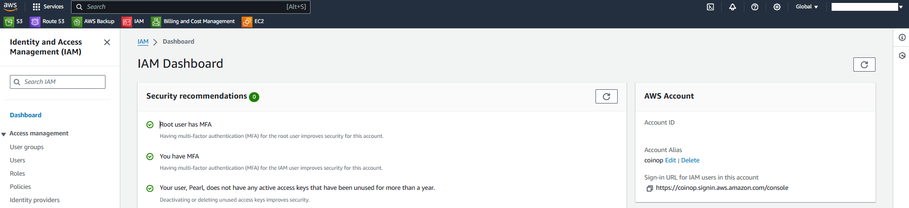
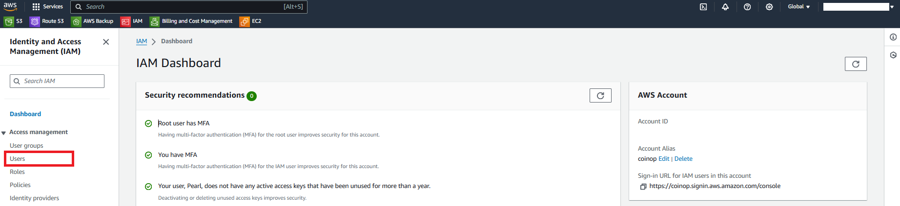
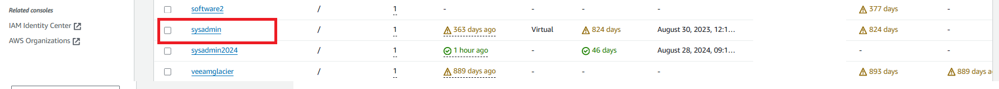
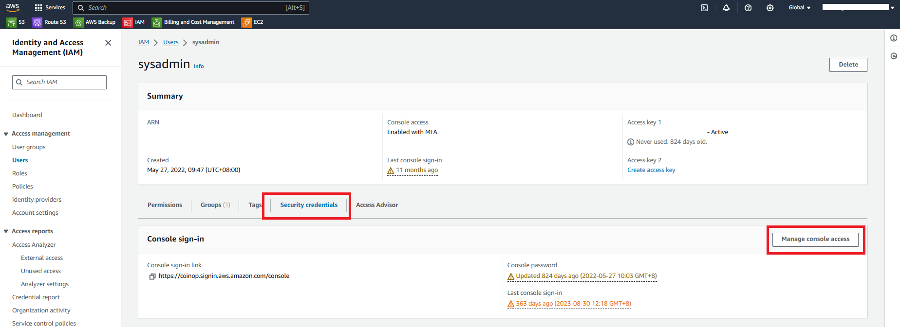
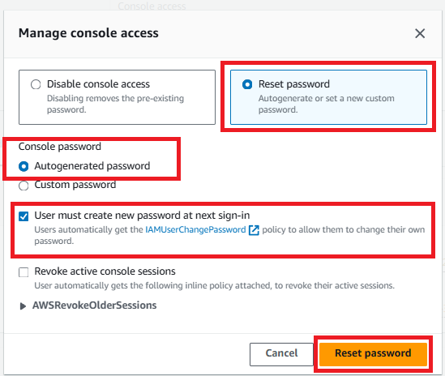

# Changing an IAM Users Password (Console)

This guide provides a step-by-step procedure for changing an IAM user's password using the AWS Management Console. This is essential for managing access and ensuring that users have secure, up-to-date credentials.

## Prerequisites :-

+ AWS Account: Ensure you have an active AWS account with administrative privileges or sufficient permissions to manage IAM users.

+ IAM User Access: Access to the AWS Management Console with permissions to change IAM user passwords.

## Steps :- 

Sign in to the AWS Management Console and open the IAM console at https://console.aws.amazon.com/iam/

In the navigation pane, choose Users.

Choose the name of the user whose password you want to change.

Choose the Security credentials tab, and then under Console sign-in, choose Manage console access.

In Manage console access, choose Reset password if not already selected. If console access is disabled, then no password is required.

For Console access, choose whether to have IAM generate a password or create a custom password:

+ To have IAM generate a password, choose Autogenerated password.

+ To create a custom password, choose Custom password, and type the password.

To require the user to create a new password when signing in, choose User must create a new password at next sign-in.

**Note:** If you select the User must create a new password at next sign-in option, make sure that the user has permission to change his or her password. For more information, see Permit IAM users to change their own passwords.

To view the password so you can share it with the user, choose Show in the Console password dialog box.

