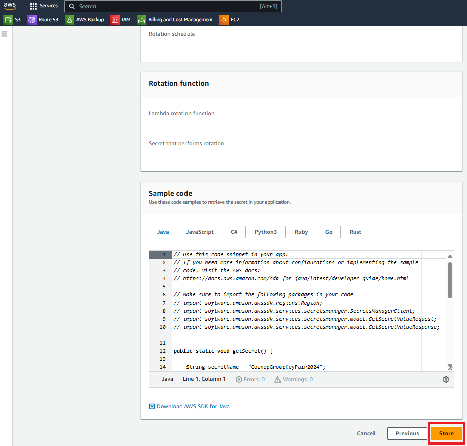

# Securing SSH Private Keys using AWS Secrets Manager

This guide details how to use AWS Secrets Manager to securely store and manage SSH private keys. AWS Secrets Manager helps you protect sensitive information such as SSH private keys and retrieve them programmatically when needed.

## Prerequisites :-

+ AWS Account: An active AWS account with appropriate permissions to use AWS Secrets Manager.

+ SSH Private Key: The private key you wish to store securely.

## Steps :- 

### Open AWS Secrets Manager

Log into the AWS Management Console.

Go to the AWS Secrets Manager service and click on "Store a new secret."

### Input Your Secret

Choose "Other type of secrets."

Select the "Plaintext" tab.

Paste your SSH private key from the .pem file into the provided text area. (Be sure to clear any existing JSON format {“”:””} to avoid token errors, as the JSON parser may not handle the key correctly.)

### Set Up Encryption and Name

Use the default encryption key to secure your SSH key.

Give your secret a descriptive name.

Optionally, add tags for better management.

Disable rotation if it is not required for your use case.

### Save Your Secret

Click "Next"

Click "Store" to finalize the process.

