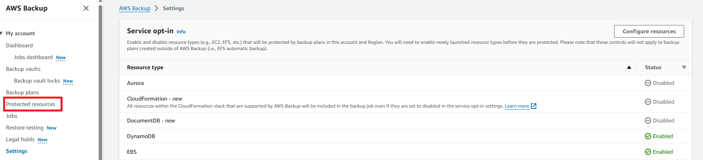

# 🚑 Backup an Amazon EC2 Instance 🚑

## Introduction 

Want to ensure your data is safe and recoverable? This comprehensive guide will walk you through the process of backing up an Amazon EC2 instance, providing you with the peace of mind that your data is secure and can be restored if needed.

By the end of this guide, you'll be able to effectively back up your Amazon EC2 instance, ensuring your data is secure and recoverable. Let's get started!

## Prerequisites 🚨

+ An AWS account
+ One or more Amazon EC2 instances

## Configure an On-demand AWS Backup Job of an Amazon EC2 Instance 🚢

**Step 1** — Log in to the AWS Management Console

Open your web browser and navigate to the AWS Management Console: https://aws.amazon.com/console/

Sign in with your AWS account credentials.

**Step 2** — Access the AWS Backup Console

Navigate to the AWS Backup console.

**Step 3** — Setting Up an On-Demand AWS Backup Job for an Amazon EC2 Instance

**3A** — Configuring Services Used with AWS Backup

In the AWS Backup console's left navigation pane under "My account," select "Settings."

On the Service opt-in page, click on "Configure resources."

Navigate to the Configure resources page and use the toggle switches to enable or disable the services integrated with AWS Backup. For EC2, toggle the switch to enable. Click "Confirm" once your services are configured.

**3B** — Creating a Manual Backup Task for an Amazon EC2 Instance On-Demand

Return to the AWS Backup console, and in the left navigation pane under "My account," choose "Protected resources."

From the dashboard, click on the "Create on-demand backup" button.

On the "Create on-demand backup" page, follow these steps:

+ Select "EC2" as the resource type to back up.

+ Choose the Instance ID of the specific EC2 resource you want to backup.

+ Ensure "Create backup now" is enabled to initiate your backup immediately and view the saved resource sooner on the "Protected resources" page.

+ Specify your preferred retention period. AWS Backup automatically manages the deletion of backups to optimize storage costs.

+ Choose an existing backup vault. Alternatively, create a new vault by following the prompts.

+ Under IAM role, select "Default role."

+ Click the "Create on-demand backup" button. You'll be directed to the Jobs page where you can monitor the backup job.

Select the Backup job ID associated with the resource to view job details.

## Setting Up an Automated AWS Backup Job for an Amazon EC2 Instance 🛕

**Step 1** — Log in to the AWS Management Console

Open your web browser and navigate to the AWS Management Console: https://aws.amazon.com/console/

Sign in with your AWS account credentials.

**Step 2** — Go to the AWS Backup console

Open the AWS Backup console.

**Step 3** — Setting Up an Automated AWS Backup Job for an Amazon EC2 Instance

**3A** — Configuring Services Used with AWS Backup

In the left navigation pane of the AWS Backup console under "My account," select "Settings."

On the Service opt-in page, click on "Configure resources."

On the Configure resources page, toggle the switches to enable or disable the services integrated with AWS Backup. Once configured, click "Confirm" to save your settings.

**3B** — Creating a Backup Plan for an Amazon EC2 Instance

Navigate to the AWS Backup console, select "Backup plans" under My account in the left navigation pane, and then choose "Create backup plan."

AWS Backup offers three ways to start using backup plans. For this tutorial, select "Build a new plan":

+ **Start with a template:** Begin with a pre-defined template provided by AWS Backup, which incorporates best practices and common backup policy configurations.

+ **Build a new plan:** Customize a backup plan by specifying backup configuration details manually.

+ **Define a plan using JSON:** Modify an existing backup plan JSON expression or create a new one.

**Backup plan name:** Provide a unique name for your backup plan (e.g., test-backup).

**Backup rule name:** Define a backup rule name (e.g., test-backup-daily), which is case-sensitive and can contain alphanumeric characters or hyphens.

**Backup frequency:** Determine the frequency of backups (e.g., every 12 hours, daily, weekly, monthly).

**Backup window:** Specify the start time and duration (in hours) of the backup window.

**Retention period:** AWS Backup manages backup deletion to optimize storage costs. Set retention periods between 1 day and 100 years.

Click "Create plan" to proceed.

**3C** — Allocate resources to the backup plan

Provide a resource assignment name and specify resource selection criteria.

For resource ID-based assignment, choose Resource type and specify the resource's name.

To exclude specific resource IDs, select Resource type and specify the name of the resource to exclude.

Click "Assign resources" to allocate resources to the backup plan.

Next, check the AWS Backup console for backup jobs under "Jobs".

## Final Note

If you find this repository useful for learning, please give it a star on GitHub. Thank you!

**Authored by:** [ELemenoppee](https://github.com/ELemenoppee)
