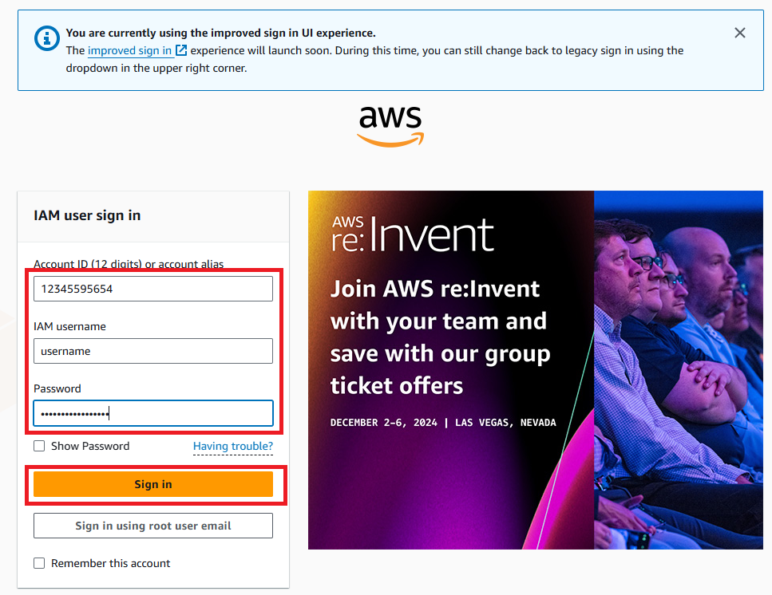
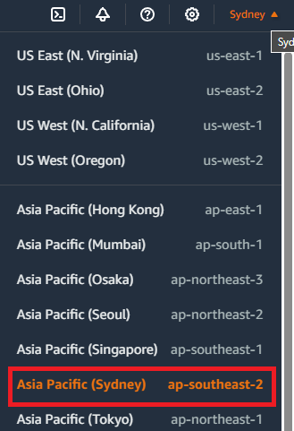
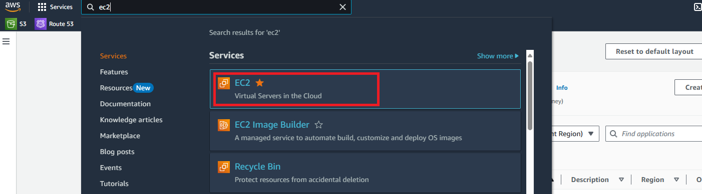
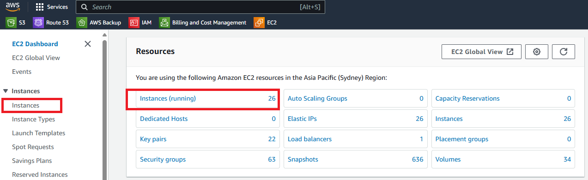
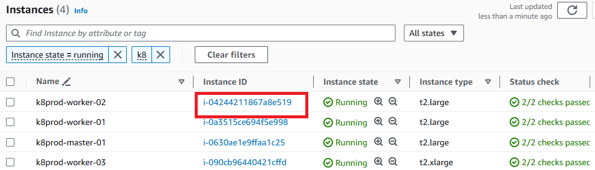
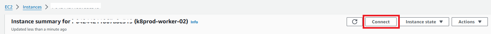
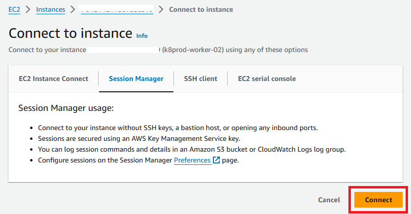

# Create EC2 Instance User

## Description 

This guide explains how to create and manage a user on an Amazon EC2 instance. This process is useful for creating additional users with SSH access or managing permissions for different roles on your server.

## Steps :-

### Log in to the AWS Management Console

Open your web browser and go to the AWS Management Console at https://aws.amazon.com/console/.



### Select a Region

Choose the region where your EC2 instance is located, such as "Asia Pacific (Sydney)."



### Search for EC2 Service

In the search bar, type "EC2" and click on the EC2 service from the results.



### Access EC2 Instances

From the EC2 dashboard, select "Instances" to view your running instances.



### Choose Your EC2 Instance

Find and select the EC2 instance where you want to create a new user.



### Connect to the Instance

Click on "Connect" and choose "Session Manager" as the connection method.



### Initiate the Connection

Once the connection settings are verified, click "Connect" again to log in to your instance.



### Create a New User

Once logged into the EC2 instance, execute the following commands to create a new user. Replace testuser with the desired username.

```bash
sudo -i
adduser testuser
cd ~
mkdir .ssh
chmod 700 .ssh/
touch .ssh/authorized_keys
chmod 600 .ssh/authorized_keys
```

### Add the User's Public Key

Add the public SSH key of the new user to the authorized_keys file for secure access. Replace testkey with the actual public key.

```bash
echo "testkey" >> .ssh/authorized_keys
```

**Note**: Ensure that you correctly replace testuser with the username you want to create and testkey with the public key for that user. This allows the new user to securely log in to the EC2 instance via SSH.

