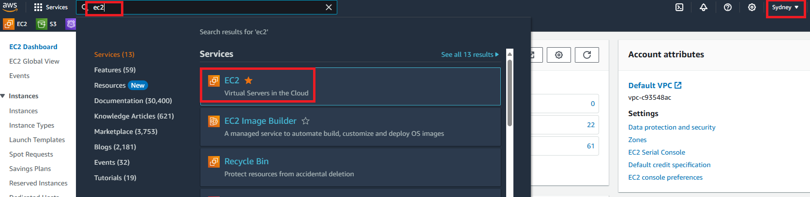
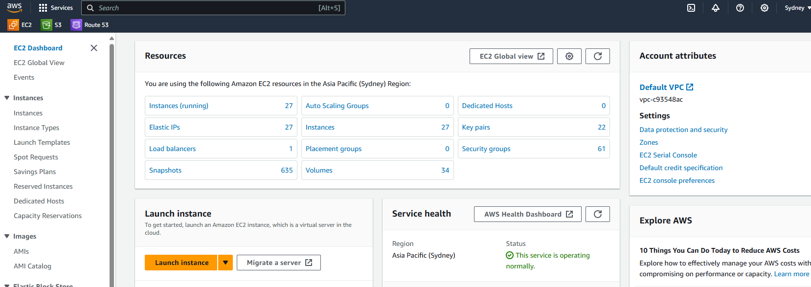
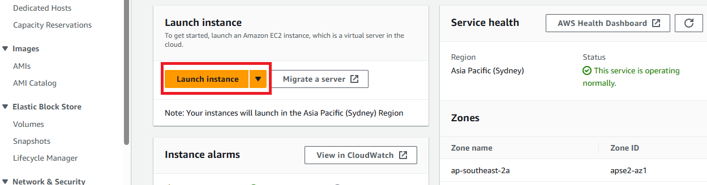
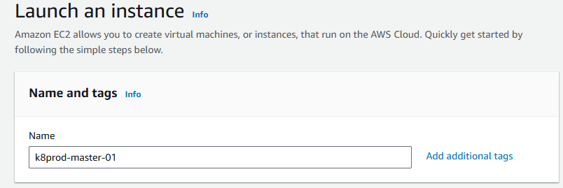
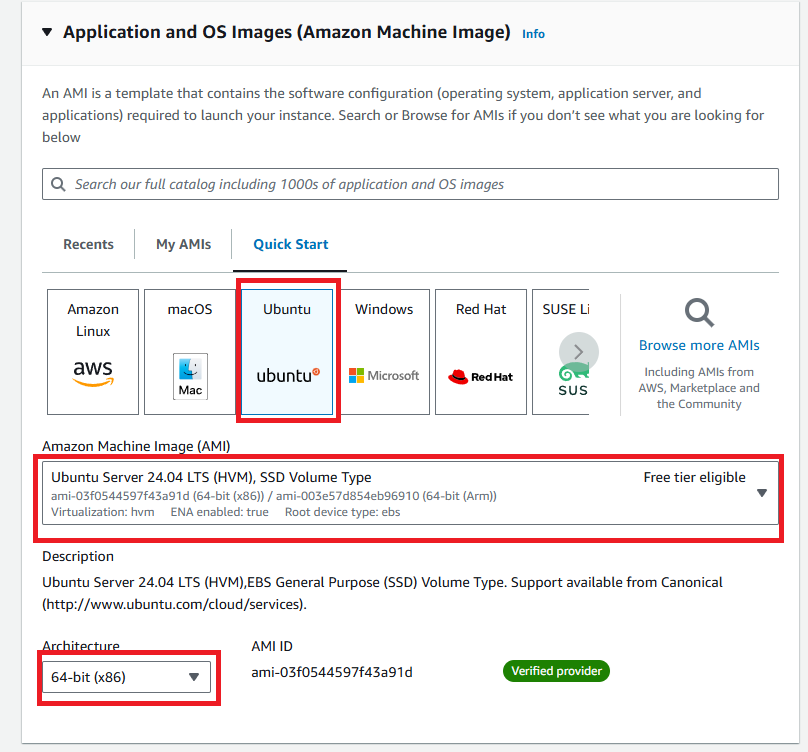
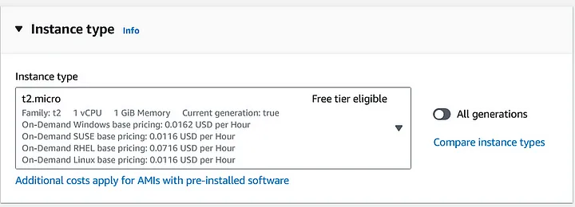
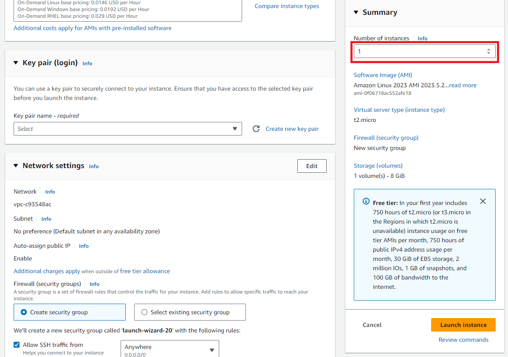
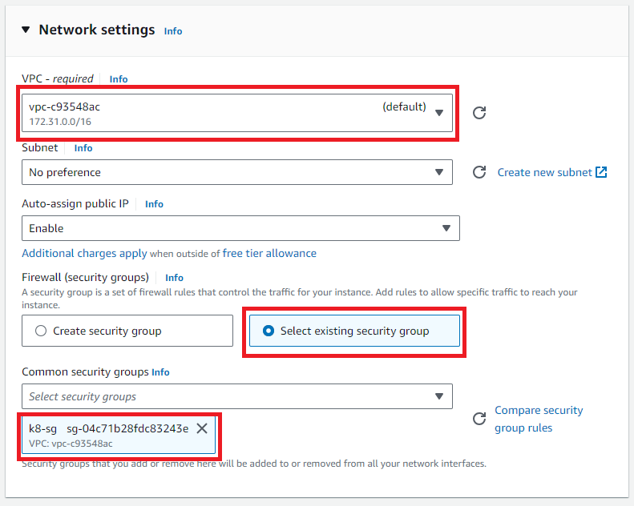
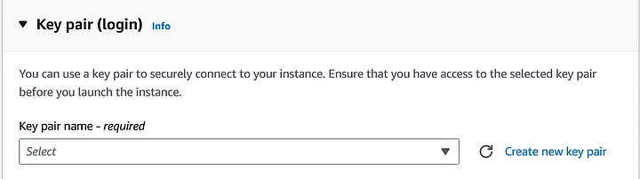

# 🪬 How to Create an Amazon EC2 Instance: A Step-by-Step Guide 🪬

## Description 

Want to launch your own virtual server on AWS? This comprehensive guide will walk you through the process of creating an Amazon EC2 instance, providing you with the flexibility and scalability to run your applications in the cloud.

By the end of this guide, you'll have your own Amazon EC2 instance up and running, ready to deploy your applications in the cloud. Let's get started!

## Prerequisites 👽

 + An Amazon Web Services (AWS) account: You’ll need an active AWS account to create EC2 instances.

 + AWS Console Access: Log in to the AWS Management Console.

## Steps 👓:-

**Step 1** — Log in to the AWS Management Console

Open your web browser and navigate to the AWS Management Console: https://aws.amazon.com/console/

Sign in with your AWS account credentials.

**Step 2** — Navigate to EC2 Dashboard

After logging in, you will be in the AWS Management Console. Select the "Sydney" Availability Zone. In the search bar labeled "Find Services," type "EC2" and choose "EC2" from the results. This will take you to the EC2 Dashboard.

Result: 

**Step 3** — Launch EC2 Instance

On the EC2 Dashboard, click the “Launch Instance” button to initiate the instance creation process.

**Step 4** — Name your Instance

**Step 5** — Choose an Amazon Machine images/image (AMI)

Select an AMI that meets your requirements, such as Amazon Linux, Ubuntu, Windows Server, etc.

**Step 6** — Choose an Instance Type

When launching an instance, the instance type determines the underlying hardware's compute, memory, and storage capabilities. Instance types are categorized into families based on these capabilities. Choose an instance type that aligns with your application or software requirements.

+ In the “Choose an Instance Type” section, select the appropriate instance type based on your workload’s resource needs. Instance types vary in CPU, memory, storage, and networking capabilities.

+ Click on your desired instance type. Detailed information about each instance type is available by clicking the information icon.

**Step 7** — Configure Instance Details

Specify the number of instances you want to launch and configure other instance details as needed.

**Step 8** — Configure Network Settings

Choose a Virtual Private Cloud (VPC) and subnet for your instance.

In the “Network Settings” section, define security rules for your instance. Security groups act as virtual firewalls, controlling inbound and outbound traffic.

You can create a new security group or select an existing one.

**Step 9** — Create a Key Pair

In this step, create a new key pair or use an existing one. Key pairs are essential for securely accessing your instance using SSH.

Select “Create a new key pair,” name it, and download the private key file (.pem). Ensure to keep this file secure as it’s required to access the instance.

**Step 10** — Review Instance Launch

Review all configuration settings for the instance.

Click the “Launch” button if all settings are correct.

**Step 11** — Accessing Your Instance

Once your instance is running, locate its public IP address in the EC2 Dashboard under “Instances.”

To connect to your instance using SSH (for Linux/Unix) or Remote Desktop (for Windows), use the private key downloaded in Step 9.

## Final Note

If you find this repository useful for learning, please give it a star on GitHub. Thank you!

**Authored by:** [ELemenoppee](https://github.com/ELemenoppee)