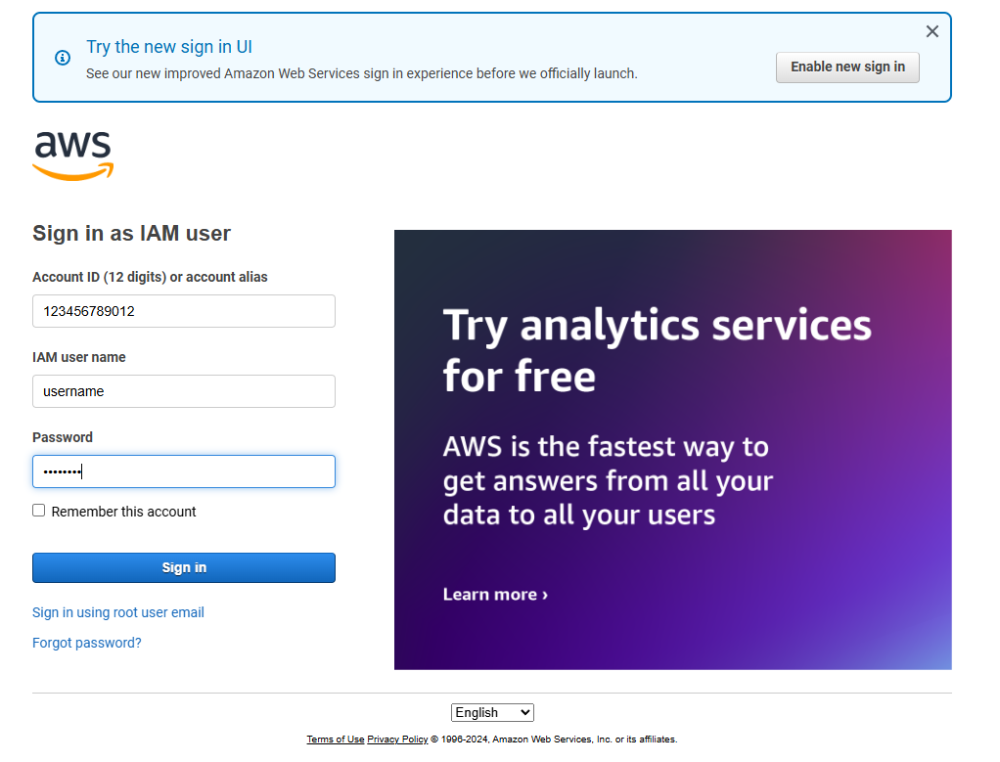
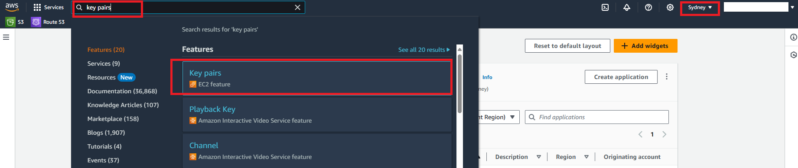
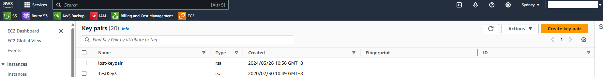
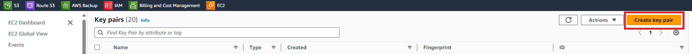
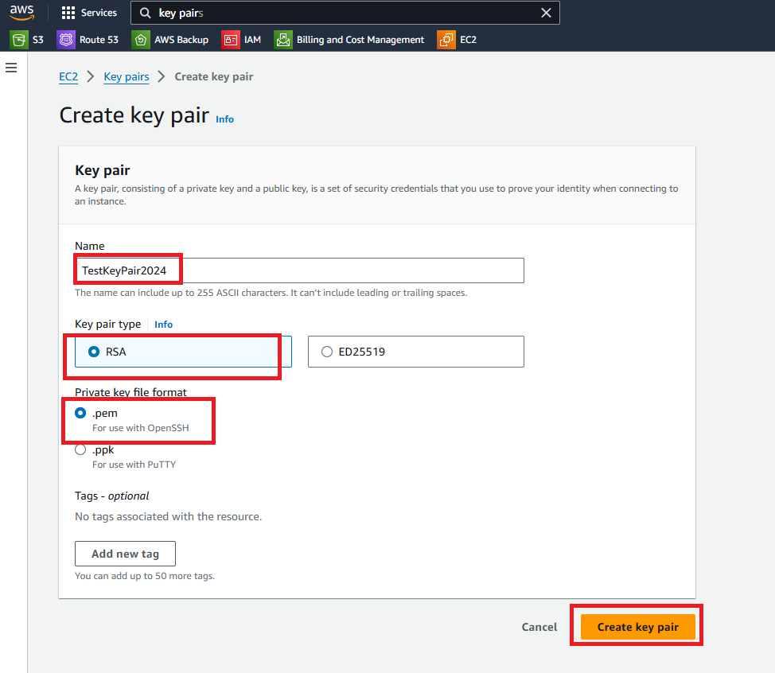
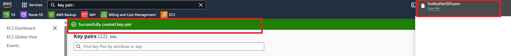

# Creating an EC2 Key Pair and Adding a Private Key to an EC2 Instance

This guide provides instructions on creating a new EC2 key pair and adding a private key to an existing EC2 instance. This is useful for securely managing SSH access to your EC2 instances.

## Prerequisites :-

+ AWS Account: An active AWS account with appropriate permissions.

## Steps :-

### **Step 1** — Access the AWS Management Console

Log In: Start by logging into the AWS Management Console at : https://aws.amazon.com/console/



### **Step 2** — Locate Key Pairs

Set Region: Change your region to Sydney (ap-southeast-2).

Search for Key Pairs: In the search bar, type "Key Pairs" and select it from the search results.



View Key Pairs: You should be directed to the Key Pairs section where you can view and manage your key pairs.



### **Step 3** — Create a New Key Pair

Initiate Creation: Click on the "Create key pair" button.



Configure Key Pair:

+ Enter a name for your new key pair.

+ Select "RSA" as the key pair type.

+ Choose ".pem" as the private key file format.

+ Click "Create key pair" to complete the process.



Download Private Key: After successful creation, a notification will confirm the key pair creation, and a private key file (.pem) will be automatically downloaded to your computer.



### **Step 4** — Generate a Private Key

Log In to Linux Machine: Access a Linux machine.

Transfer and Generate Public Key: Transfer the downloaded private key to the Linux machine. Use the following command to generate the corresponding public key:

```bash
ssh-keygen -y -f TestKeyPair2024.pem > TestKeyPair2024.pub
```

### **Step 5** — Add the Public Key to the EC2 Instance

Log In to EC2 Instance: Access your EC2 instance.

Update Authorized Keys: Open the .ssh/authorized_keys file with your preferred text editor. Paste the public key information from the newly created key pair and save the file.

Test Access: Disconnect from your instance and verify that you can connect using the new private key file.

### **Step 6** — Test the New Key Pair

Update Permissions: On your local Linux machine, ensure that the private key file has the correct permissions:

```bash
chmod 400 TestKeyPair2024.pem
```

Connect Using SSH: Use the following command to connect to your EC2 instance:

```bash
ssh -i TestKeyPair2024.pem ubuntu@<EC2_INSTANCE_IP_ADDRESS>
```

## Final Note

If you find this repository useful for learning, please give it a star on GitHub. Thank you!

**Authored by:** [ELemenoppee](https://github.com/ELemenoppee)
