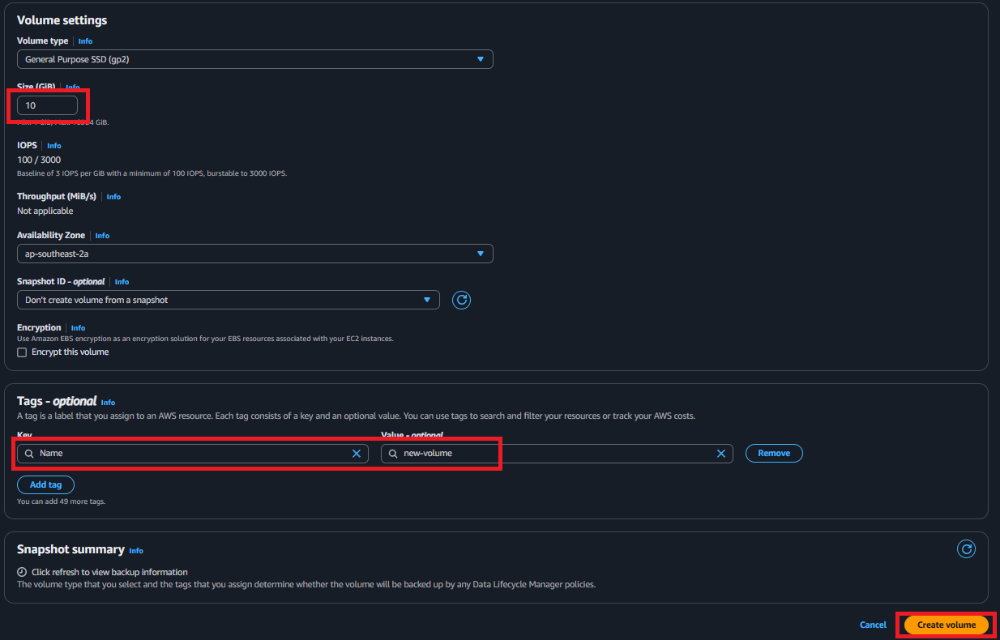
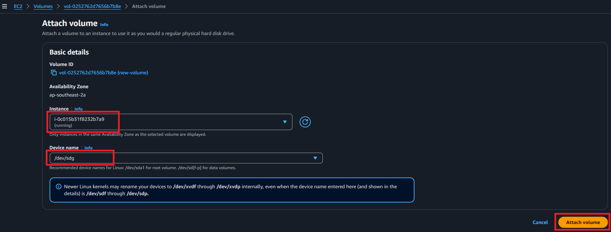
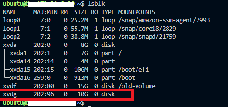
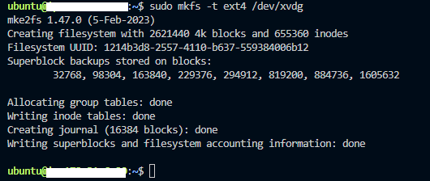
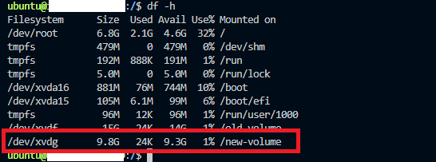

# Reducing the Size of an EBS Volume: A Step-by-Step Guide

Have you ever wondered if it's possible to reduce the size of an EBS (Elastic Block Store) volume in AWS? Unfortunately, the direct answer is NO—EBS volume sizes can only be increased, not decreased. For example, if you attempt to shrink a 100GB EBS volume to 15GB, you'll encounter an error: "The size of a volume can only be increased, not decreased."

## Workaround: Create a New Smaller Volume

To achieve a smaller storage size, you can create a new volume with the desired size and copy the data from the old volume to the new one. Below, we'll walk through how to do this, assuming the following setup:

## Assumptions:
+ You have an existing 15GB EBS volume named old-volume.
+ You want to reduce it to 10GB, naming the new volume new-volume.

## Steps:-

### 1- Login to the AWS Console

Access the AWS Management Console to manage your volumes and instances.

### 2- Create a New EBS Volume

Navigate to the EBS Volumes section in the AWS Console.

Create a new EBS volume with the desired size (e.g., 10GB) in the same availability zone as the existing volume.

Name the new volume new-volume.



### 3- Attach the New Volume

Attach the newly created volume to your instance.

Start the instance and SSH into it.



### 4- Mount the New Volume

Identify Filesystem Names: Use the command below to list all attached block devices:

```bash
lsblk
```

Sample output will display the attached volumes and their device names:



Create a Filesystem: Format the new volume with a filesystem (e.g., ext4):

```bash
sudo mkfs -t ext4 /dev/xvdg
```

sample output:



Create a Mount Point: Create a directory to mount the new volume:

```bash
sudo mkdir /new-volume
```

Mount the Volume: Mount the new volume to the directory:

```bash
sudo mount /dev/xvdg /new-volume
```

Verify the Volume is Mounted: Check the mounted volume with:

```bash
df -h
```

Sample output will confirm the mount:



### 5- Copy Data from the Old Volume to the New Volume

To transfer data:

Navigate to the directory of the old volume:

```bash
cd /old-volume
```

Use the rsync command to copy the contents:

```bash
sudo rsync -axv . /new-volume/
```

Relax and wait for the operation to complete.

### 6- Detach the Old Volume

Once the data transfer is complete, unmount the old volume:

```bash
sudo umount /dev/xvdf
```

## Summary

Although AWS does not support directly reducing EBS volume sizes, this workaround allows you to achieve the same result by creating a smaller volume and transferring data. This method ensures no data loss and provides a practical solution to managing your storage requirements efficiently.
