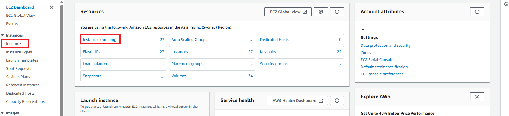
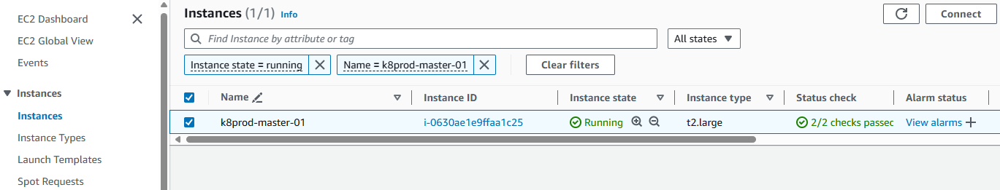
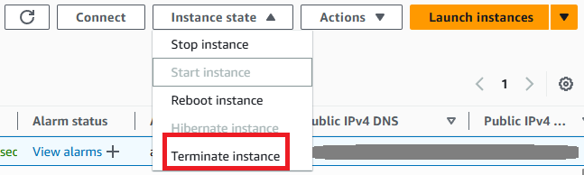

# 🏝 How to Delete an Amazon EC2 Instance: A Step-by-Step Guide 🏝

## Introduction

Need to remove an unused EC2 instance to save costs or clean up your AWS environment? This comprehensive guide will walk you through the process of safely deleting an Amazon EC2 instance, ensuring you free up resources and avoid unnecessary charges.

By the end of this guide, you'll be able to safely and efficiently delete Amazon EC2 instances, helping you manage your AWS environment more effectively. Let's get started!

## Steps ⌛️:-

**Step 1** — Log in to the AWS Management Console

First, log in to your AWS Management Console:

https://aws.amazon.com/console/

**Step 2** — Access the EC2 Dashboard

Once logged in, navigate to "Services" in the top navigation bar and select "EC2" from the dropdown menu. This action will direct you to the EC2 Dashboard.

**Step 3** — Choose the Instance to Delete

In the EC2 Dashboard, click on "Instances" in the left-hand menu to see a list of your running instances. Select the instance you wish to delete by checking the box next to its name.

**Step 4** — Terminate the Instance

After selecting the instance, go to "Instance State" > "Terminate." A confirmation dialog will appear, asking you to verify your decision to terminate the instance. Click "Yes, Terminate" to proceed.

Note: Terminating an instance is irreversible. Ensure you have backed up any necessary data or configurations before continuing.

The instance state will change to "shutting-down" initially and eventually to "terminated" once the termination process is complete. It may take a few moments for the instance to terminate fully.

## Final Note

If you find this repository useful for learning, please give it a star on GitHub. Thank you!

**Authored by:** [ELemenoppee](https://github.com/ELemenoppee)