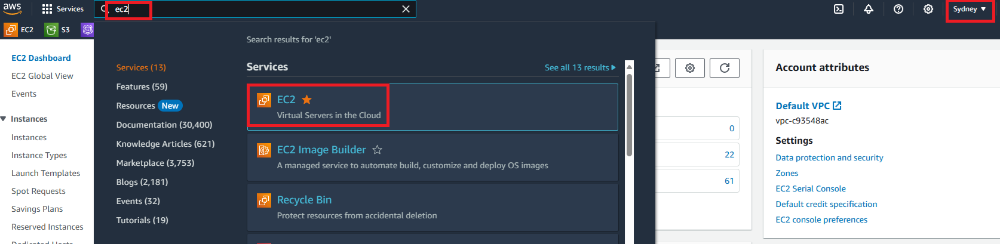
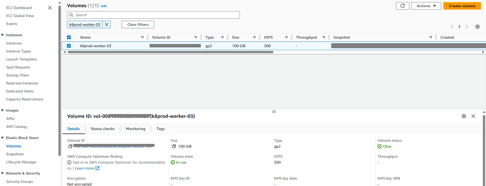

# 🤖 Creating an AWS EBS Snapshot

## Introduction

Want to ensure your data is safe and recoverable in case of an issue? This comprehensive guide will walk you through the process of creating and using Amazon EBS (Elastic Block Store) snapshots, providing you with the peace of mind that your data is securely backed up and can be restored when needed.

By the end of this guide, you'll be able to effectively create and use EBS snapshots, ensuring your data is securely backed up and easily recoverable. Let's get started!

## Prerequisites

Before you begin creating and using EBS snapshots, ensure you have the following:

+ **AWS Account:** A registered AWS account with permissions to manage EC2 instances and EBS volumes.

+ **Basic Knowledge of EC2 and EBS:** Familiarity with EC2 instances and EBS volumes.

+ **Internet Connection:** A stable internet connection to access the AWS Management Console.

Once you have these prerequisites in place, you are ready to proceed with creating and using EBS snapshots.

## Steps 👓:-

**Step 1** — Access the AWS Management Console

Open your web browser and navigate to the AWS Management Console: https://aws.amazon.com/console/

Sign in with your AWS account credentials.

**Step 2** — Navigate to EC2 Dashboard

Once logged in, you'll be in the AWS Management Console. Select the "Sydney" Availability Zone. In the "Find Services" search bar, type "EC2" and select "EC2" from the results. This will take you to the EC2 Dashboard.

Result: 

**Step 3** — Select EBS Volumes

From the EC2 Dashboard, choose "Volumes" from the left-hand menu. This will show a list of your EBS volumes. Identify and select the volume you want to create a snapshot for by clicking on its row.

**Step 4** — Start Snapshot Creation

With the EBS volume selected, go to the "Actions" dropdown menu and choose "Create Snapshot." A dialog box will appear where you can add a description for the snapshot. Descriptive names can help with future reference.

**Step 5** — Review and Confirm

After adding a description, review the settings to ensure they meet your requirements. Check the source volume, description, and any associated tags. Once confirmed, click the "Create Snapshot" button.

**Step 6** — Monitor Snapshot Progress

AWS will now start creating the snapshot. You can monitor its progress on the "Snapshots" page. Once the snapshot status changes to "completed," it means the snapshot is ready for use.

## Final Note

If you find this repository useful for learning, please give it a star on GitHub. Thank you!

**Authored by:** [ELemenoppee](https://github.com/ELemenoppee)