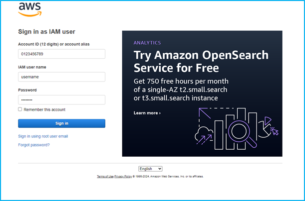
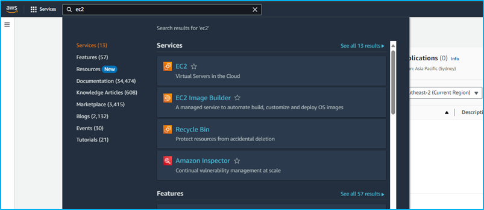
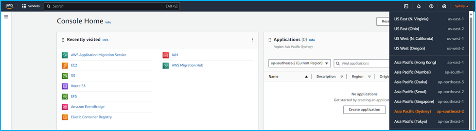
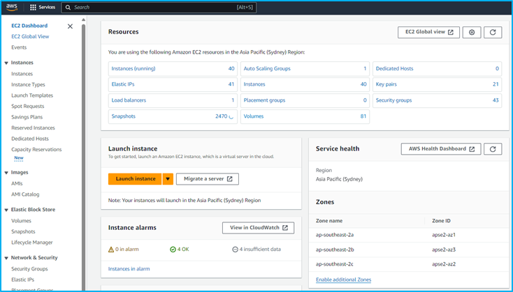
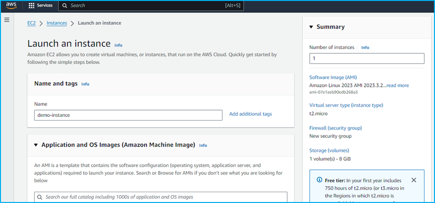
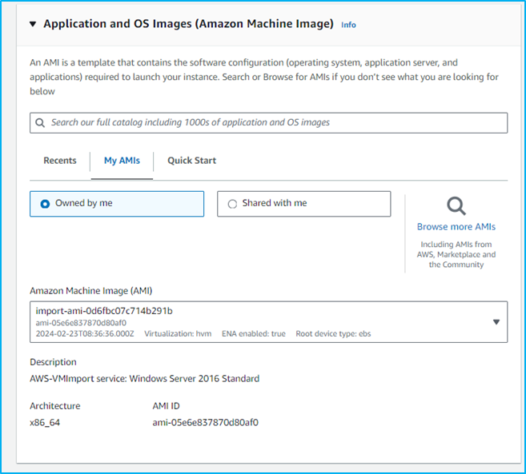
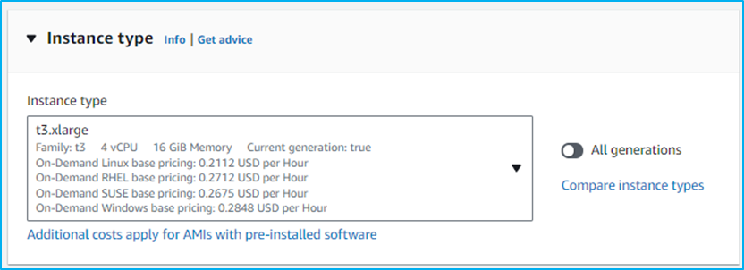
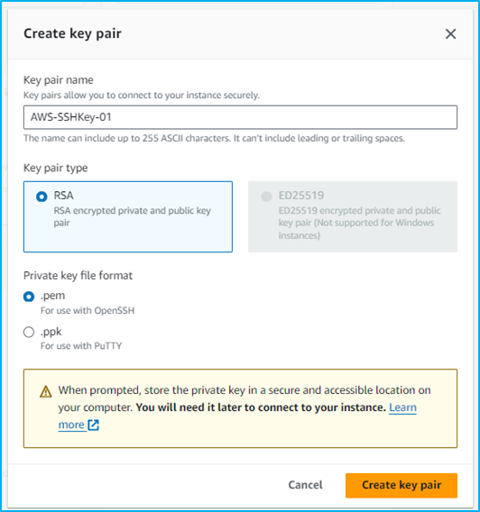
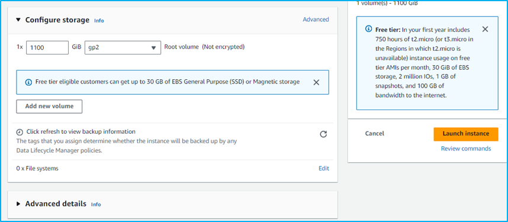
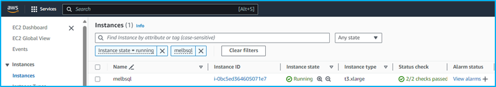

# Launching an EC2 Instance with an AMI

## Introduction

Discover how to quickly launch an Amazon EC2 instance using an Amazon Machine images/image (AMI). This comprehensive guide will walk you through the process, ensuring you can deploy and manage your EC2 instances effectively.

By the end of this guide, you'll have a fully functional EC2 instance launched with an AMI, ready for your applications and services. Let's get started!

## Prerequisites

Before you begin launching an EC2 instance with an AMI, ensure you have the following:

+ **AWS Account:** An AWS account with permissions to create and manage EC2 instances.

Once you have these prerequisites in place, you are ready to proceed with launching an EC2 instance using an AMI.

## Steps :-

**Step 1** — Log in to the AWS Management Console

**Step 2** — Navigate to EC2 Service

**Step 3** — Select Region

**Step 4** — Launch EC2 Instance

## Detailed Step-by-Step Guide :-

**Step 1** — Log in to the AWS Management Console

Log in to the AWS management console with a root or IAM user account.

**Step 2** — Navigate to EC2 Service

In the global search box, type "EC2" and select it from the results.

**Step 3** — Select Region

At the top right corner of the EC2 dashboard, select the AWS Region where you want to set up your EC2 server (e.g., Asia Pacific (Sydney)).

**Step 4** — Launch EC2 Instance

On the EC2 Dashboard, click the “Launch Instance” button.

The instance creation wizard will open, guiding you through the configuration process.

In the “Application and OS Images (Amazon Machine Images)” section, select “My AMIs,” then choose “Owned by me” and select your target AMI.

Choose an EC2 Instance Type that suits your needs (e.g., t3.xlarge).

Create and Download a Key Pair: If you don’t have an existing key pair, create one and download the private key for future use when launching instances.

Review and Launch Instance: Review your configuration settings, make any necessary adjustments, and click “Launch” when ready.

Access the Amazon EC2 Instance

## Final Note

If you find this repository useful for learning, please give it a star on GitHub. Thank you!

**Authored by:** [ELemenoppee](https://github.com/ELemenoppee)