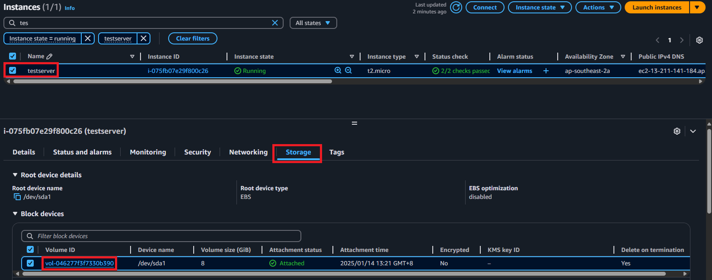
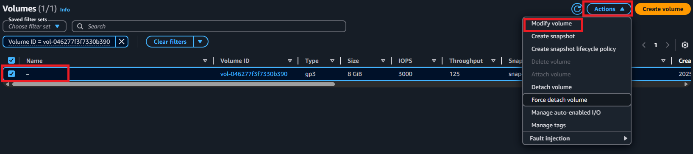
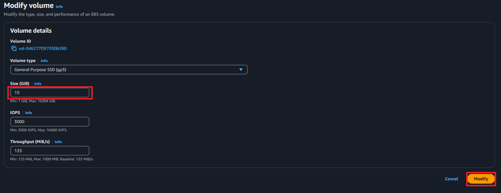
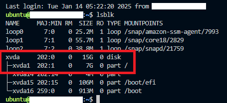
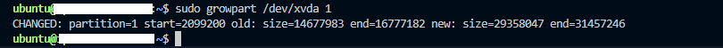
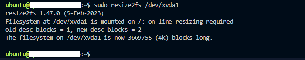
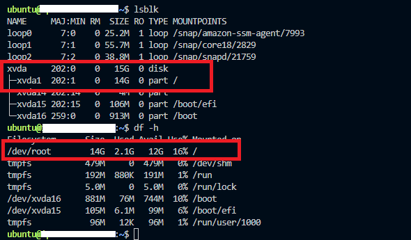

# Expanding the Size of an EBS Volume

When the storage capacity of an Amazon EBS volume becomes insufficient for your workload, you can easily resize the volume without detaching it from the instance. Below is a step-by-step guide to increase the size of an EBS volume.

## Steps:-

### 1- Login to AWS Management Console

Access the AWS Management Console.

Navigate to the EC2 service.

### 2- Locate the Volume

Go to EC2 Instances and select the instance attached to the volume you want to resize.

Click on the Storage tab, then select the Volume ID linked to the instance.



### 3- Modify the Volume

In the EBS Volumes section, choose the desired volume.

Click on Actions > Modify Volume.



### 4- Increase the Volume Size

Adjust the Size field to the desired value.

Click Modify to confirm the changes.



### 5- Verify the New Size in the Server

Use an SSH client to log in to your EC2 instance.

Run the following command to check the updated disk size:

```bash
lsblk
```

The output will display the new volume alongside the existing partition.

Example:
+ xvda1: Current partition (e.g., 7GB).
+ xvda: Updated volume size (e.g., 15GB).



### 6- Extend the Partition

Extend the partition to utilize the newly added space using this command:

```bash
sudo growpart /dev/xvda 1
```

+ /dev/xvda: Refers to the device.
+ 1: Refers to the partition number.

Sample Result: 



### 7- Resize the File System

To complete the process, resize the file system to use the new partition size:

```bash
sudo resize2fs /dev/xvda1
```

This ensures that the operating system can utilize the entire expanded volume.

Sample Result:



### 8- Validate the Changes

Confirm the updated storage allocation by running the lsblk command again:

```bash
lsblk
```

You should now see the volume with its full, expanded capacity.



## Summary

By following these steps, the EBS volume size is increased and fully allocated to your instance. For example, if you expanded the volume from 7GB to 15GB, the new storage space will now be available for use.

This process enables you to dynamically adjust storage as needed without downtime or detaching the volume.