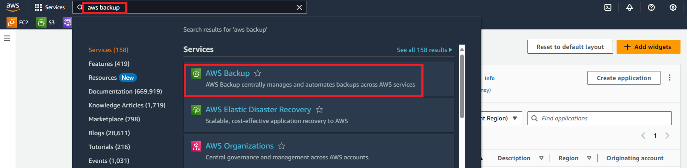

# 🕹 Restore an Amazon EC2 Instance using AWS Backup 🕹

## Introduction

Accidentally deleted your instance or need to recover from a failure? This comprehensive guide will walk you through the process of restoring an Amazon EC2 instance, ensuring your data and applications are back online quickly and efficiently.

By the end of this guide, you'll be able to effectively restore your Amazon EC2 instance, minimizing downtime and ensuring business continuity. Let's get started!

## Steps 🛎:-

**Step 1** — Log in to the AWS Management Console

Open your web browser and navigate to the AWS Management Console: https://aws.amazon.com/console/

Sign in with your AWS account credentials.

**Step 2** — Access the AWS Backup Console

Navigate to the AWS Backup console.

Navigate to "Backup Vault" and select "Default."

Under "Recovery points," choose the "Recovery Point ID" you wish to restore.

To initiate the EC2 instance restore, select the recovery point ARN and click on "Restore."

The restore ARN screen will display configurations for the EC2 instance using the backed-up AMI and attached EBS volumes.

In the Network settings section, accept default settings or specify options such as Instance type, Virtual Private Cloud (VPC), Subnet, Security groups, and Instance IAM role settings.

In the Restore role section, either accept the Default role or choose an IAM role for AWS Backup to assume during the restore process.

After configuring all settings, click "Restore backup." The Restore jobs pane will appear, and a message at the top will provide details about the restore job.

Check the status of your restored backup job under "Restore jobs" in the AWS Backup console.

## Final Note

If you find this repository useful for learning, please give it a star on GitHub. Thank you!

**Authored by:** [ELemenoppee](https://github.com/ELemenoppee)