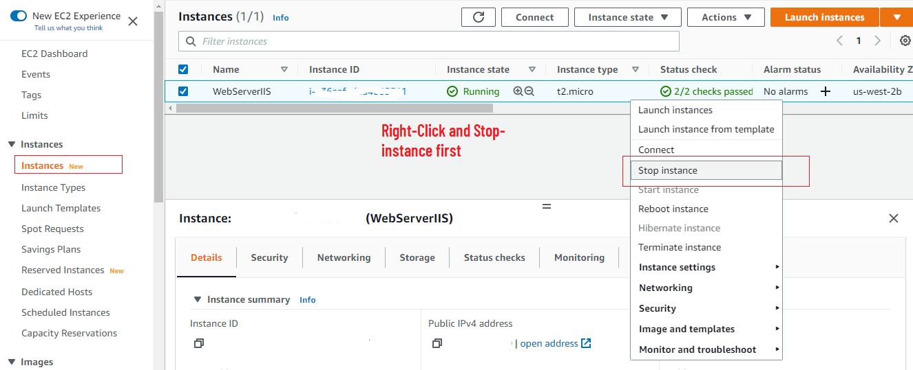
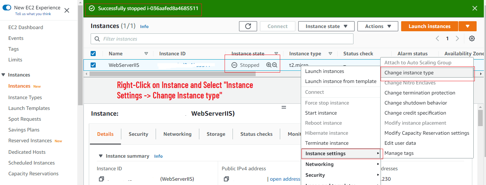
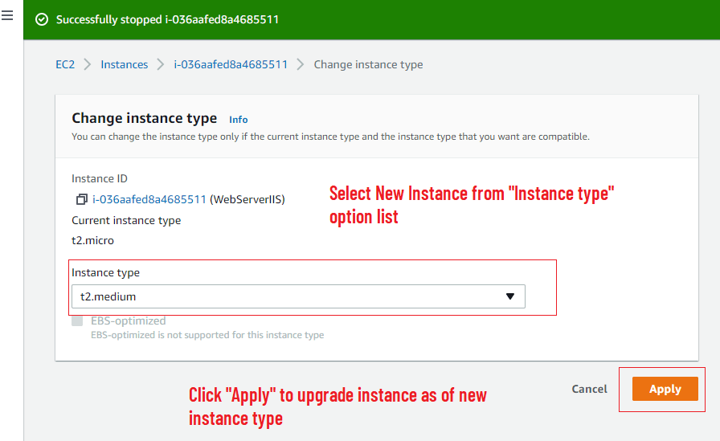
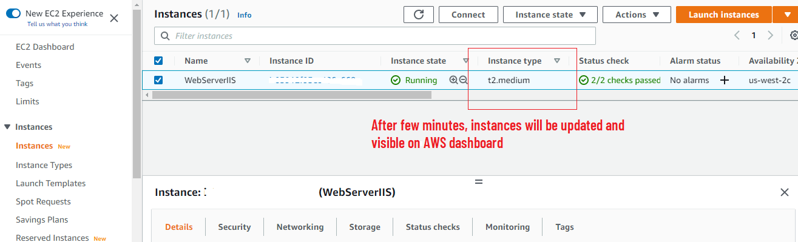

# ✂️ How to Upgrade or Downgrade an Amazon EC2 Instance: A Step-by-Step Guide ✂️

## Introduction

Need to adjust the resources for your applications? This comprehensive guide will walk you through the process of upgrading or downgrading an Amazon EC2 instance, providing you with the flexibility to scale your resources up or down based on your needs.

By the end of this guide, you'll be able to efficiently upgrade or downgrade your Amazon EC2 instance, ensuring your applications have the resources they need. Let's get started!

## Steps ⏱:-

**Step 1** — Login into your AWS EC2 Console: https://aws.amazon.com/console/

**Step 2** — Navigate the Instances

Navigate to "Instances" and Select instance which you want to upgrade.

**Step 3** — Stop the Instance

Right-click on the instance and choose "Stop Instance." You must stop the instance before making changes to its instance type.

**Step 4** — Change Instance Type

Once the instance is stopped, right-click on it, navigate to "Instance Settings," and select "Change Instance Type."

On the instance selection screen, choose the new instance type (e.g., upgrade from "t2.micro" to "t2.medium") and click "Apply."

**Step 4** — Start the Instance

Right-click on the instance and select "Start Instance" to restart it with the new instance type.

After a minute or two, the instance will be running with the upgraded or downgraded instance type.

## Final Note

If you find this repository useful for learning, please give it a star on GitHub. Thank you!

**Authored by:** [ELemenoppee](https://github.com/ELemenoppee)